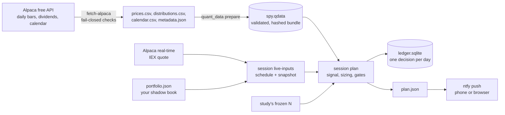

# HFT-IBKR

A daily trading-research system for **SPY**, the S&P 500 ETF. Once per trading day it
decides whether a portfolio should hold SPY or cash. It uses free market data, records
each decision in a ledger and can send it to your phone.

**It never places, changes or cancels orders.** Every decision is a *shadow* decision
for a portfolio file you keep. Only you can trade.

**New here? Start with [SETUP.md](SETUP.md).**

> **Not high-frequency trading, despite the name.** Research on 2026-10-05 closed the
> intraday branch for the current account, for three reasons:
>
> - IBKR Lite has no API access.
> - A cash account can only turn over about its capital each day.
> - Order-flow signals showed no edge once the bid-ask spread was paid.
>
> See the [blueprint review](docs/research/2026-10-05-architecture-blueprint-review.md).

## At a glance

| Question | Answer |
| --- | --- |
| What does it trade? | SPY only, long or cash, whole shares. No leverage, no shorting. |
| How does it decide? | It holds SPY while SPY's dividend-adjusted price is above its moving average of the last N trading days. Otherwise it holds cash. |
| How often? | Once per trading day, one minute after the 09:30 New York open. |
| What data? | Daily closing prices through yesterday plus dividends, and one live quote to price the trade. All from Alpaca's free plan. |
| What comes out? | `BUY n shares`, `SELL all`, `HOLD` or `BLOCKED` with reasons. Frozen in a ledger and pushed to your phone. |
| Does it trade for me? | No. |
| Does it make money? | Unknown. A [pre-registered study](studies/spy-daily-v1/PREREGISTRATION.md) on 2016–2026 history decides whether the rule has earned a shadow period. Past results would not guarantee future ones either way. |

## How it decides

The rule is in [`quant_research/strategy.py`](quant_research/strategy.py). It is
deliberately simple: it has one tunable number, the lookback N.

**Step 1: a total-return price index.** On a dividend's ex-date, SPY's price drops by
about the dividend amount. That isn't a real loss for an investor, so the rule follows
an index that adds dividends back:

```text
index[first day] = close[first day]
index[day t]     = index[day t-1] × (close[t] + dividend[t]) / close[t-1]
```

`dividend[t]` is the cash dividend going ex on day t, and zero on most days. The
arithmetic uses exact fractions, so there is no rounding drift.

**Step 2: compare with its moving average.** With lookback N (100, 150 or 200 trading days):

```text
average[t] = mean of index over the last N trading days, including day t
signal[t]  = LONG  if index[t] >  average[t]
             CASH  if index[t] <= average[t]   (a tie counts as CASH)
             WARMUP until N days of history exist
```

**Step 3: turn yesterday's signal into today's action.**

| Signal at yesterday's close | Shares held now | Action |
| --- | --- | --- |
| LONG | none | **BUY** |
| LONG | some | **HOLD**, never rebalanced or topped up |
| CASH | some | **SELL** every share |
| CASH | none | **HOLD** |

Positions are all-in or all-out. A rule like this usually changes position a few
times a year; most days the answer is HOLD.

**Which N?** The study tests N = 100, 150 and 200. It picks the one with the highest
return over 2021-01-11 to 2023-06-30 after doubling all costs; a tie goes to the
smaller N. It freezes that choice, then tests it once on 2023-07-11 to 2026-10-02.
The daily runner then uses the frozen N automatically. Until the study has run, it
uses the original 200-day hypothesis.

## When it acts

All times are New York time. The runner reads the exchange calendar (from Alpaca), so
holidays, 1 pm early closes and daylight-saving changes are handled.

```text
Day 1  16:00  Market closes. Day 1's closing price completes the signal for day 2.
Day 2  06:00  Runner wakes, or starts whenever you launch it. It reads the calendar:
              trading day?  -> wait for the open
              holiday?      -> "Market closed today", sleep until tomorrow
       09:31  One minute after the open:
                1. download daily bars through day 1, plus dividends and calendar
                2. re-check the data (see "What can block a decision")
                3. compute the signal from day 1's close
                4. take SPY's live quote and size the trade
                5. apply every gate, record ONE decision for day 2, send it to your phone
       later  Nothing. One decision per trading day.
Day 3  06:00  Wakes again.
```

- **No look-ahead.** A day's decision uses only prices through the previous close.
  Today's prices never affect today's signal; the code enforces this and tests check it.
- **Execution is at or after the open.** The historical study models the same timing:
  signal at one day's close, simulated fill at the next day's open.
- **Outside 09:30–16:00 nothing is recorded.** Starting early only prepares the data.
- **Decisions are frozen.** Each session's decision is stored once in a SQLite ledger.
  Rerunning that day reprints it, and different inputs for a decided day are refused.

## How big a trade is

For a **BUY**, the target is whole shares worth about **95%** of the shadow portfolio's
value at the current ask price. It is then reduced until every limit holds. These
values come from [`studies/spy-daily-v1/config.json`](studies/spy-daily-v1/config.json):

| Limit | Rule |
| --- | --- |
| Cash | price × shares + fees must not exceed *settled* cash |
| Position size | at most 98% of the portfolio's value |
| Share cap | at most 1,000 shares |
| Order size | at most $100,000 per order |
| Liquidity | at most 0.1% of SPY's previous-session volume |

A **SELL** is always the full position. The portfolio is valued at the live bid:
`value = cash + shares × bid`.

## What can block a decision

The data is checked **before** any decision. If any check fails, the download stops
and nothing is written:

- daily bars must match the exchange calendar exactly;
- every quarter must have a dividend;
- bar timestamps must be New York midnight;
- daily bars must agree with regular-session minute bars on ten sample days.

Then each of these **gates** can turn a decision into `BLOCKED`, with the reason shown:

| Reason | Meaning |
| --- | --- |
| `OUTSIDE_EXECUTION_WINDOW`, `QUOTE_BEFORE_OPEN` | Not inside today's trading session |
| `SIGNAL_NOT_COMPLETED` | Yesterday's close is not final yet |
| `CAUSAL_COVERAGE` | Downloaded history doesn't match the calendar |
| `WARMUP` | Fewer than N days of history |
| `STALE_QUOTE`, `FUTURE_QUOTE` | Quote older than 60 s, or timestamped in the future (check the PC clock) |
| `STALE_ACCOUNT`, `FUTURE_ACCOUNT` | Portfolio snapshot older than 5 minutes, or timestamped in the future |
| `HALTED` | You set `"halted": true` in your portfolio file: a manual stop for everything |
| `DRAWDOWN_LIMIT` | Portfolio is 20% or more below its peak. Blocks new **buys** only; exits stay allowed. |
| `CASH_LIMIT`, `EXPOSURE_LIMIT`, `CAPACITY_LIMIT`, … | No whole-share size fits the limits above |

## What it assumes about costs

| Cost | Assumption |
| --- | --- |
| Commission | $0 (IBKR Lite on US ETFs) |
| Sell fees | 0.3 basis points of the sale, covering the SEC Section 31 fee and FINRA's trading activity fee |
| Spread, live | Already paid by pricing buys at the ask and sells at the bid |
| Slippage and impact | +1.5 bp per side live; +2 bp per side in the historical study (half-spread 0.5, slippage 1, impact 0.5) |
| Stress | The study reports results at 1×, 2× and 5× these costs and decides at 2× |

Not modeled: taxes, interest on idle cash, and auction or price-improvement details.

## How it all fits together



| Piece | What it does |
| --- | --- |
| [`scripts/run_daily.sh`](scripts/run_daily.sh) | The one command you start. Runs the study once if needed, then each trading day waits for the open, runs `daily_shadow.sh` and sends notifications. Stop with Ctrl-C. |
| [`scripts/daily_shadow.sh`](scripts/daily_shadow.sh) | One day's pipeline: fetch → prepare → live inputs → plan → summary. Safe to rerun. |
| [`scripts/run_study.sh`](scripts/run_study.sh) + [`scripts/study_verdict.py`](scripts/study_verdict.py) | The one-time pre-registered study and its mechanical verdict |
| `quant_data` | Free-data download (`fetch-alpaca`) and strict intake into a hashed `.qdata` bundle |
| `quant_research` | The rule, cost model, risk limits, backtest, chronological evaluation and single-use holdout registry |
| `quant_session` | Live inputs, the daily planner, the freeze-once ledger and the market clock |

The shadow book is `.research-output/shadow/portfolio.json`. **Nothing updates it for
you.** If you want the shadow to "follow" a BUY, edit the file: shares bought, cash
reduced by about shares × price. If you don't, it will keep proposing the same BUY.

## Is the rule any good? The pre-registered study

[`studies/spy-daily-v1`](studies/spy-daily-v1/PREREGISTRATION.md) fixed the data,
periods, candidates, costs and decision rule in Git *before* any real data was
downloaded. Results therefore can't be fitted after the fact.

1. **Data:** raw daily SPY prices and dividends, 2016 to 2026-10-02.
2. **Periods:** 2016 is warm-up; 2017–2020 development; 2021-01-11 to 2023-06-30
   validation picks N; 2023-07-11 to 2026-10-02 is the **holdout**. There are 5-session
   gaps between periods, and each period starts with fresh $50,000 cash.
3. **Single release:** the holdout can be released exactly once. The registry refuses
   any rerun, rename or overlapping window.
4. **Verdict at 2× costs** against buy-and-hold over the same days:

| Outcome | Condition | Consequence |
| --- | --- | --- |
| DOMINATES | Return ≥ buy-and-hold **and** max drawdown ≤ buy-and-hold | Shadow it |
| RISK_REDUCING | Lower return, but lower max drawdown | Shadow it only as a risk-control overlay |
| DOMINATED | Max drawdown not lower than buy-and-hold | Reject the rule for this period |

A negative return blocks any shadow. **Realistic expectations:** the rule probably
will *not* beat simply holding SPY. Its historical strength is smaller crashes, not
alpha. See the [realistic odds assessment](docs/research/2026-10-05-realistic-odds.md)
for estimated probabilities, 150 years of base rates and a daily-data whipsaw check.

Honest limits:

- The whole period is public history, and the 200-day rule is widely known.
- It is one asset and one price path, with few trades.
- No statistical significance is claimed. Only the forward shadow period is truly out of sample.

## Get started

**Follow [SETUP.md](SETUP.md)**: copy-paste steps for Windows + WSL, with a check
after each step. More detail is in the
[Windows + WSL runbook](docs/operations/windows-wsl-runbook.md). The short version, in
the Ubuntu terminal:

```sh
git clone -b FrankieBiz/feat-hft-research-review https://github.com/FrankieBiz/HFT-IBKR.git
cd HFT-IBKR && make check build demo      # tests, portable build and offline demo
./scripts/run_daily.sh --check            # verifies keys, calendar and phone notifications
./scripts/run_daily.sh                    # leave running; Ctrl-C to stop
```

Requirements:

- Python 3.11+ on Linux, WSL or macOS. No third-party packages.
- A free Alpaca paper account (email only, no card); keys go in `~/.config/alpaca/paper.env`.
- Optionally, the free ntfy app for phone notifications; the channel name goes in
  `~/.config/hft-ibkr/notify.env`.

The IB Gateway is not needed. An optional read-only API check is in the runbook.

## Files and data

| Path | Contents |
| --- | --- |
| `studies/spy-daily-v1/` | Pre-registration, protocol and config, committed before any data |
| `.research-output/` | Everything generated: data, bundles, reports, ledger and `shadow/run.log`. Ignored by Git. |
| `~/.config/alpaca/paper.env` | Your Alpaca keys. Never committed or printed. |

Alpaca's terms allow personal, non-commercial use and forbid redistribution. The tools
refuse to write Alpaca data anywhere in this repository except the ignored
`.research-output/`.

## Other components

These are offline reference tools from earlier work. Commands are in the
[component reference](docs/reference/components.md).

- **Research engine:** replay, chronological evaluation and single-use holdouts with
  1×/2×/5× costs, dividend receivables, drawdown halts and rejected-trade reports.
- **Order-control reference (SIM only):** a fail-closed reservation, reconciliation and
  journal model with 14 acceptance scenarios. It is not an IBKR adapter.
- **Results dashboard:** a static HTML view of research and control reports.
- **Paper Gateway check:** a read-only API handshake test. It requests no data and sends no orders.
- **Local GPU preflight:** an environment inventory for possible future model work.

## Research history

- [Realistic odds: will it work, make money or generate alpha?](docs/research/2026-10-05-realistic-odds.md)
- [Blueprint review: microstructure claims, replications and test power](docs/research/2026-10-05-architecture-blueprint-review.md)
- [HFT research decision](docs/research/2026-10-05-hft-research-decision.md) and the closed [order-flow plan](docs/plans/hft-edge-research-plan.md)
- [Daily trend design](docs/superpowers/specs/2026-10-04-etf-trend-research-design.md) and [delivery plan](docs/plans/quant-trading-delivery-plan.md)
- [Broker assumptions](docs/research/2026-10-04-broker-assumptions.md) and [AI model decision](docs/research/2026-10-04-ai-model-decision.md)
- [Original architecture proposal (historical)](docs/plans/optimize-quant-trading-system.md)
