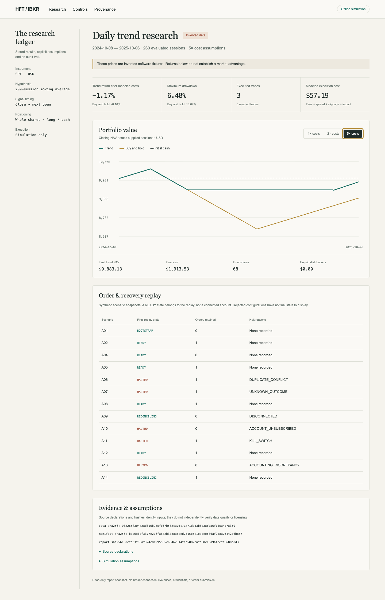

# Component reference

Detailed commands and contracts for each component, moved from the README on
2026-10-05. The README explains how the daily system decides and when it acts; this
page is the command-level reference. Everything here is offline unless stated.

## Local operator app

`quant_app` provides Overview, Setup, Decisions, Portfolio and Activity in a local
browser. Python 3.11+, Bash and POSIX locks are required; use WSL/Ubuntu on Windows.
The runtime is standard-library-only with bundled HTML/CSS/JavaScript, no npm or
CDN assets. From the checkout:

```sh
./scripts/run_app.sh
# Equivalent module entry point:
python3 -m quant_app
# Portable entry point, still requiring the checkout for scripts and study files:
python3 dist/quant-system.pyz app --root "$PWD"
```

The backend binds to `127.0.0.1:8765`, opens `http://localhost:8765` and uses
`cmd.exe` to open the Windows browser under WSL. Options include `--port NUMBER`
and `--no-browser`; `--root PATH` identifies the checkout. The optional
`Start-Trading-App.cmd` desktop launcher uses the default WSL distribution and
`~/HFT-IBKR`. It is not a native installer. See the
[Windows/WSL runbook](../operations/windows-wsl-runbook.md).

No job, download or provider request starts from launch/status refresh. Explicit
buttons run fixed local checks, the historical study, the readiness-gated data
connection check or daily runner. Study/evidence, feed, source and risk gates remain
in force. The app reuses existing study/registry/ledger/book paths and never resets
history. Existing qualified SIP studies retain SIP and the corrected request window.

The app supervises one owned job at a time and shares the runner lock with terminal
starts. Stop affects owned process groups only; external runners must be stopped
in their terminals. Ctrl-C in the launch terminal stops the backend and its owned
jobs; browser closure leaves them running. Book/key actions are blocked while an
app job or external runner is active. App state lives in ignored
`.research-output/app/`; explicit fill accounting is in
`.research-output/shadow/fills.sqlite`.

Key-entry fields are blank and never reveal stored values. Save explicitly writes
private `~/.config/alpaca/paper.env` outside Git. Starting cash initializes only a
fresh portfolio with no decision/fill history. Decisions come from whole-chain
verified ledger history; corrupt evidence blocks display/progression rather than
being replaced by arbitrary reports.

A BUY/SELL remains a proposal until the operator explicitly records the full latest
verified proposal's simulated fill. The app verifies its original session snapshot
against current book cash, settled cash, shares and halt state, requires a positive
price and nonnegative fees, and journals before/after hashes with a unique decision
identity. Duplicate fills and unexplained book divergence fail closed.
**Recover pending accounting** explicitly completes a recoverable interrupted
journal update without changing settlement or halt state; pending/corrupt fill
journals also block terminal runners before readiness or network calls. Buys spend
settled cash; sells add unsettled proceeds. Settlement is an explicit operator
confirmation, not a clock or provider event. Partial fills, deposits/withdrawals,
broker reconciliation and automatic fill inference are unsupported.

Manual global halts and the separate ledger drawdown entry latch are preserved;
the former blocks all proposals and the latter blocks buys while permitting eligible
signal exits. There is no app halt reset. Portfolio charts show dated valid simulated
NAV marks from verified decisions, not live P&L or broker balances. The
[approved app design](../superpowers/specs/2026-10-06-operator-app-design.md) records
scope and dated primary references.

## Integrated daily shadow session

The `session plan` workflow joins completed-session data, a declared schedule, a
portfolio/quote snapshot, independent cost-aware sizing and a durable decision
ledger. Snapshots are either synthetic or built by `session live-inputs` from the
free Alpaca calendar and IEX quote. Reports explain BUY/SELL proposals, HOLD or
BLOCKED. `plan` never imports a broker SDK, opens a socket, or submits or cancels
orders. Snapshot declarations and model costs are not verified broker state or
economic evidence.
See the [shadow-session runbook](../operations/shadow-session-runbook.md).

## Run locally

No third-party dependencies. Use Python 3.11+ on macOS or Linux; local validation
used Python 3.14.0. The control journal uses POSIX file locking.
From the repository root:

```sh
make check build demo
```

This runs the tests, builds `dist/quant-system.pyz`, and creates a fresh directory
under `.research-output/` with research, validation, holdout, all 14 control scenarios,
and crash/restart artifacts, plus shadow buy/hold/sell/blocked reports and durable
retry/conflict checks. `summary.json` records the end-to-end result.
The portable archive supports `python3 dist/quant-system.pyz research ...` and
`python3 dist/quant-system.pyz control ...`; those commands can run outside this
checkout. The `app` command bundles the UI but still needs a checkout for its jobs,
study protocol and operator scripts.

## Results dashboard

The automatic demo generates `dashboard.html` alongside its reports. It is a
self-contained read-only view of equity curves, cost scenarios, final holdings,
source hashes, assumptions and synthetic control states. The cost buttons update
stored results without rerunning a strategy. No external assets or broker calls.



The archive provides `view render --research REPORT --control CONTROL_REPORT
--output NEW_HTML` (repeat `--control` as needed) and
`view serve --page HTML --port 8765` to serve just that page on loopback. The
dashboard is a snapshot, not a live account interface. Rejected configurations
emit no final-state report; the demo still validates all 14 acceptance scenarios.

## Paper Gateway connection diagnostic

For a separately prepared paper Gateway, an optional official-SDK, non-ordering
API connection diagnostic is available. See the
[Windows/Ubuntu paper Gateway setup](../operations/paper-gateway-setup.md).
It is not a broker adapter and is never invoked by the offline demo.

## Local AI environment checks

The diagnostic runs without installing Laya or downloading weights:

```sh
mkdir -p .research-output
python3 -m quant_local preflight --output .research-output/local-preflight.json
```

The archive supports `python3 dist/quant-system.pyz local preflight --output PATH`.
It inventories RAM, installed package versions and NVIDIA devices. If PyTorch is
installed in the invoking environment, an isolated child performs a small CUDA
tensor operation with a 30-second deadline. Use `--gpu-index N` for a logical
PyTorch device or `--skip-cuda` to avoid importing PyTorch entirely.

Exit 2 means blocked or invalid input; a blocked report lists the missing evidence.
Exit 0 means only `ready_for_model_benchmark`. It does not mean Laya was run or
that trading is ready. The combined-stack preflight targets Linux/WSL2 and Python
3.12–3.14 with conservative memory budgets documented in the report. No packages
are installed, no model is loaded, and no account is accessed. Existing output
files are preserved; use a fresh filename for each run.

## Individual research replay

The data-intake pipeline now accepts separate local price, distribution and
calendar exports with explicit source/license declarations. It produces one
validated `.qdata` bundle atomically; generated bundles are excluded from Git.
Research replay/evaluate/holdout accept `--bundle PATH` instead of the existing
`--data` plus `--manifest` pair. `make demo` now prepares and inspects the synthetic
bundle and confirms its financial results match the original fixture automatically.
See the [intake design](../superpowers/specs/2026-10-04-data-intake-design.md).
Source declarations remain unverified; no real historical dataset is included.

For an individual research report:

```sh
mkdir -p .research-output
python3 -m quant_research replay \
  --data examples/synthetic_spy_daily.csv \
  --manifest examples/synthetic_spy_manifest.json \
  --config examples/research_config.json \
  --output .research-output/synthetic-report.json
```

The output destination must not already exist. Choose another filename for another
run. `--evaluation-start YYYY-MM-DD` selects a supplied session after at least
`lookback` completed warmup sessions; default is the first eligible session.

```sh
python3 -m unittest discover -s tests -v
python3 -m compileall -q quant_research quant_control scripts tests
```

Reports contain the input and source hashes, explicit configuration/provenance,
all assumptions, next-open fills, fees, price friction, rejected trades, equity
history and remaining positions/receivables. Decimal amounts serialize as strings.
Exit 0 means valid replay completed (possibly with rejected trades), 2 means invalid
input/output destination, and 1 means unexpected runtime failure.

## Chronological evaluation

Predeclare development, validation and holdout ranges and candidate lookbacks in
a protocol. The example is entirely synthetic. Each interval starts flat with
fresh capital, with preceding prices used only to warm causal features. The selector
uses validation return at 2x costs, with a smaller lookback breaking ties. This
illustrates a reproducible procedure; it does not establish statistical significance.

```sh
python3 -m quant_research evaluate \
  --data examples/synthetic_spy_daily.csv \
  --manifest examples/synthetic_spy_manifest.json \
  --config examples/research_config.json \
  --protocol examples/synthetic_protocol.json \
  --registry .research-output/experiments.sqlite \
  --run-id validation-1 \
  --selection .research-output/selection.json \
  --output .research-output/validation.json

python3 -m quant_research holdout \
  --data examples/synthetic_spy_daily.csv \
  --manifest examples/synthetic_spy_manifest.json \
  --config examples/research_config.json \
  --protocol examples/synthetic_protocol.json \
  --registry .research-output/experiments.sqlite \
  --run-id holdout-1 \
  --selection .research-output/selection.json \
  --output .research-output/holdout.json
```

Validation reports exclude holdout results. Selection is bound to stored validation,
input/config/protocol/source hashes, and an append-only registry. A holdout identity
can be released once through that registry; interrupted releases remain consumed.
The registry also claims every revealed holdout session per data kind and symbol, so
renaming a protocol, editing code or shifting the window cannot re-release a session.
Registries created before 2026-10-05 may lack session claims for earlier releases;
retain them for reviewed migration. Starting a new registry must not reopen
previously revealed final history.
Both reports include same-date buy-and-hold and zero-interest cash benchmarks under
the declared cost scenarios. Completed reports remain recoverable without rerunning:

```sh
python3 -m quant_research recover \
  --registry .research-output/experiments.sqlite \
  --run-id holdout-1 --output .research-output/recovered-holdout.json
```

The registry guards local workflow mistakes. Copying datasets or deleting the
registry can bypass that guard; it is not access control over market data.

## Current overlay readiness and diagnostics

The [current protocol](../../studies/spy-trend-v2/PROTOCOL.md) keeps v1 unchanged
and shares its registry. Operator scripts authenticate historical evidence before
external setup; synthetic CLI rehearsals remain independent. A readiness check
is entirely offline:

```sh
python3 -m quant_session.readiness \
  --bundle .research-output/spy-trend-v2/spy.qdata \
  --config studies/spy-trend-v2/config.json \
  --protocol studies/spy-trend-v2/protocol.json \
  --selection .research-output/spy-trend-v2/selection.json \
  --holdout .research-output/spy-trend-v2/holdout.json \
  --registry .research-output/spy-daily-v1/experiments.sqlite
```

`--planning-config PATH` must match the selected-lookback substitution exactly;
`--config-out NEW_PATH` publishes that verified config. Exit 2 blocks missing,
rejected, synthetic or changed-code evidence. No registry/data is initialized here.

Robustness diagnostics use development/validation history only:

```sh
python3 -m quant_research robustness \
  --bundle .research-output/spy-trend-v2/spy.qdata \
  --config studies/spy-trend-v2/config.json \
  --protocol studies/spy-trend-v2/protocol.json \
  --output .research-output/spy-trend-v2/robustness.json
```

Options are `--train-sessions` (252), `--test-sessions` (63),
`--embargo-sessions` (protocol default, cannot be weakened), `--folds` (all available
complete folds), `--block-size` (20), `--samples` (500) and `--seed` (0).
Reports freeze boundaries/settings and cost scenarios. Paired blocks share sampled
indices and do not cross reset boundaries. Closing-return resampling is conditional
path stress, not a future-success probability, rerun of risk controls or selector
for the final study. Complete input hashes still cover excluded holdout bytes.
The portable form is `python3 dist/quant-system.pyz research robustness ...`.

For independent offline runner health use:

```sh
python3 scripts/check_shadow_health.py \
  --heartbeat .research-output/shadow/heartbeat.json \
  --ledger .research-output/shadow/ledger.sqlite
```

This checker must be scheduled independently to detect a dead process. It does not
contact services or install a watchdog. See the [operator runbook](../operations/windows-wsl-runbook.md).

## Order controls and recovery

`quant_control` accepts only the synthetic account `SIM`, simulation mode and SPY
whole-share limit intents. It reserves cash/inventory before emitting simulated
submissions and retains uncertain exposure through cancel timeouts, disconnects
and restart. Duplicates do not apply cash flows or submit twice. Readiness requires
complete coherent reconciliation and an explicit reset; refreshing stale data alone
does not clear a halt. Kill requests cancellation while continuing to process fills.

```sh
python3 -m quant_control replay \
  --fixture examples/control/A08.json \
  --output .research-output/recovery-scenario.json

python3 -m quant_control continue \
  --fixture examples/control/A12.json \
  --journal .research-output/control.jsonl \
  --output .research-output/durable-control.json
```

Continuation records input durably before applying it. Reopening a journal appends
restart, preserves IDs/reservations and enters reconciliation. Continuation fixtures
must use the next absolute event sequence after that restart; inputs are never
silently renumbered. The hash chain detects damaged records, and a single writer is
enforced. Corruption or storage failure stops continuation. See the
[operator runbook](../operations/offline-runbook.md) for recovery limits.

## Input and model assumptions

Use raw unadjusted daily OHLC, whole-share volume and distributions, with CSV header:

```text
session,open,high,low,close,volume,dividend,dividend_pay_date
```

The manifest must declare source, UTC retrieval date, raw-price policy, complete
dividend coverage/no splits, CSV SHA-256 and exact expected sessions with a calendar
source. The loader checks hashes and internal consistency; it cannot independently
verify the provider's calendar, dividend coverage or licensing. Splits and adjusted
prices are rejected. The example calendar is synthetic weekdays, not an exchange
calendar; its SPY-labeled prices are invented.

Distributions accrue on ex-date for previously held shares, add to NAV and become
spendable only on the simulated pay date. Entry sizing uses prior-close information
and is reduced for current-open affordability. Capacity uses prior-session volume.
Open gaps and closing marks both count toward drawdown. A halt blocks buys; it does
not imply liquidation. An inadmissible full exit stays open and is reported.

The example $10,000 cash balance, exposure/risk limits and fees are test assumptions,
not a suggested capital allocation, calibrated impact model or exact IBKR fee quote.
The simulator excludes tax, cash yield, settlement delays, partial-fill queues and
live auction behavior. Fund expenses are already reflected in market prices and
are not subtracted twice. End positions remain marked; the last signal is unfilled.
