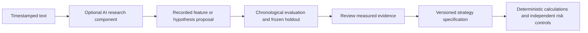

# Decision: Jev, Layla and Laya for this trading system

Hardware-specific follow-up: the user confirmed the Laya repository and a desktop
RTX 3070 Ti with 32 GB RAM. See the
[local hardware and stack decision](2026-10-04-laya-hardware-and-trading-stack.md)
for expected inference fit, proposed configuration and the revised delivery sequence.
The model remains an optional experiment; it has not been integrated.

Researched 2026-10-04. Scope: public documentation and published evaluations,
compared with this repository's implementation. No models were installed, no paid
inference was called, and no comparative trading experiment was performed.

## Decision

Keep deterministic signal calculations, accounting, risk admission, reservations
and recovery as the authoritative core. Do not replace them with Jev, Layla or Laya.
There is no evidence from the reviewed sources that such a replacement would improve
this strategy's returns after costs. The existing strategy is also economically
unproven; this decision favors a testable engineering baseline, not proven alpha.

An optional AI research component could improve usability and text processing.
Evaluate it separately before feeding any proposed feature into strategy research.
For a future strictly local structured classifier, Laya is the relevant candidate
to investigate. Layla can provide an assistant interface. Hosted Jev is a possible
semantic-classification comparator if external inference is explicitly authorized.
None is selected for immediate trading integration.

## Distinguish the names

| Name | Verified identity | Implication for this project |
| --- | --- | --- |
| Jev | TypeSafe's model returns typed choices, scores and yes/no probabilities. Its documented product is an authenticated hosted API. | Useful candidate for bounded text judgments; not an established local checkpoint or market forecasting model. |
| Layla | Android/iOS assistant application that can run user-selected local LLMs or cloud models. | An interface/runtime choice; trading capability depends on the actual model and workflow, not the app name. |
| Laya | Separate Apache-2.0 open model/package providing local typed decisions. | Relevant if “Layla” meant the open local alternative to Jev. Must validate the exact checkpoint on the intended domain. |

Jev facts: [official introduction](https://docs.typesafe.ai/introduction),
[API reference](https://docs.typesafe.ai/api) and
[current model documentation](https://docs.typesafe.ai/models).
I did not find an official downloadable Jev checkpoint in those primary sources.
Independent Jev-compatible projects are not the official model; examples include
[JEV-Local](https://github.com/tapsin/jev-local) and
[jevos](https://github.com/feder-cr/jev).

Layla facts: [official setup guide](https://help.layla-network.ai/getting-started/)
and [product site](https://www.layla-network.ai/). Local mode and cloud mode have
different data handling; running an assistant locally does not create fresh market
information without an input source.

Laya facts: [author repository](https://github.com/NandhaKishorM/laya) and
[model card](https://huggingface.co/convaiinnovations/laya). Its maintainers disclose
near-chance base performance on their typed-decisions benchmark, better results
after domain fine-tuning, shipped overconfidence and narrow negation failures.
Their stronger fine-tuned headline is not a financial forecasting result.

## Evidence and its limits

TypeSafe's [Jev 1.13 limitations](https://docs.typesafe.ai/model-jaggedness/jev-1.13)
specifically advise keeping arithmetic and date comparisons in code, and document
susceptibility to adversarial input and some option-order effects. A valid response
schema does not guarantee a correct decision. These are reasons to preserve exact
financial calculations and deterministic state transitions independently.

The [independent September 2026 Jev evaluation](https://arxiv.org/abs/2609.37647)
reports strong results over 37 language/classification datasets, including selective
prediction, but also threshold and rubric weaknesses. It does not compare portfolio
returns, fees, drawdowns or trading capacity against this SPY strategy. General
classification quality cannot establish a trading advantage.

The official [financial function-calling example](https://docs.typesafe.ai/cookbooks/function_calling)
routes natural-language requests to charting/statistics functions. It is evidence
for an assistant interface, not an independently evaluated profitable trading bot.

[TypeSafe's confidence documentation](https://docs.typesafe.ai/confidence) defines
confidence from the distribution over answers. Consequently, an arbitrary confident
BUY answer must not be interpreted as that probability of a profitable SPY trade.
Financial calibration would require an explicitly defined outcome and separate
chronological, domain-specific evidence.

## What could make the system stronger

Engineering assessment, not a measured model result:

- Keep moving-average calculation, prices, fees, dates, position sizing and cash
  accounting in code. A model adds no needed information to those exact operations.
- A generative assistant could explain existing reports and help propose testable
  research hypotheses. Numeric conclusions must come from stored calculations.
- A structured model could classify timestamped news or documents into predefined
  categories. It must preserve source provenance and distinguish publication time,
  event time and actual availability to the strategy.
- Any predictive feature must earn its place through a controlled comparison with
  the current strategy and common-period buy-and-hold/cash benchmarks. Better text
  classification alone is insufficient.

These potential roles are unimplemented. The current research and order-control
engines remain separate offline components; this diagram is a proposed extension:

## Conditions before adopting a model-generated trading feature

Predeclare the task and baseline; pin model/checkpoint, prompts, labels and input
hashes; retain raw predictions and failures. For pretrained models, establish the
training-data time cutoff or treat retrospective financial results as potentially
contaminated. A walk-forward split alone cannot undo information already present
in a pretrained model. Prefer a prospective shadow period where contamination is
uncertain.

Use domain-separated training/calibration/validation, record all trials, and release
the final holdout once. Compare model-free and model-assisted variants on identical
dates, capital and constraints, including execution and inference costs. Measure
returns, drawdown, turnover, rejected orders, calibration, abstention and outages.
Also test negation, option reordering, missing inputs and injected instructions.
Model failure must not bypass limits or create order authority. Only add the feature
if its measured benefit justifies the additional dependencies and failure modes.

Near-term priority remains reviewed historical data and calibrated replay, followed
by a separately implemented and authorized IBKR paper adapter. Model selection does
not remove those dependencies.
