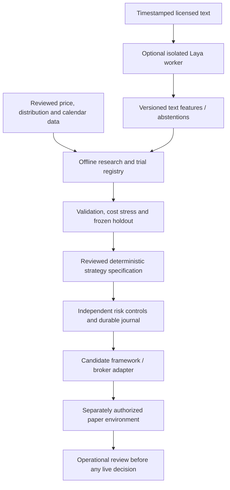

# Local Laya and trading-stack decision

Research date: 2026-10-04. Scope: the user's desktop RTX 3070 Ti and 32 GB
system RAM, Laya at the supplied GitHub URL, and a locally operated IBKR system.
This is a design decision from public primary sources, not a target-machine
benchmark or a finding of trading profitability. No models or frameworks were
installed and no broker was contacted.

## Decision

**Evaluate Laya locally as an optional text-feature worker. Keep the deterministic
strategy, accounting and risk controls. Use daily/swing ETF research as the first
market scope. Select NautilusTrader for a bounded offline integration study, with
adoption conditional on version-specific compatibility and control tests.**

This is my engineering recommendation for the present budget and codebase. Neither
a GPU nor an open-source framework establishes a market edge. Invest first in
reviewed data, realistic costs and evidence against simple alternatives. There is
no measured reason yet to replace the current strategy with an AI decision maker.

## Hardware fit

The desktop card has **8 GB GDDR6X VRAM**, according to
[NVIDIA's specifications](https://www.nvidia.com/en-us/geforce/graphics-cards/30-series/rtx-3070-3070ti/).
The user's 32 GB RAM is host memory and does not enlarge that VRAM budget.

[Laya's checkpoint table](https://github.com/NandhaKishorM/laya) lists approximately
421 million parameters for English/typed-decisions and 322 million for multilingual.
It is a non-generative typed classifier, not a conversational coding assistant.
Start with one English checkpoint, batch size one, bounded 512-token input and
`max_loaded=1` if using its router. Do not preload all three checkpoints. Long
documents and larger batches need separate memory and truncation tests.

| Weight-only estimate, calculated as parameters × bytes | English / typed | Multilingual |
| --- | --- | --- |
| FP16/BF16, 2 bytes | 0.842 GB / 0.784 GiB | 0.644 GB / 0.600 GiB |
| FP32, 4 bytes | 1.684 GB / 1.568 GiB | 1.288 GB / 1.200 GiB |

These are calculations, **not total VRAM measurements**. Loading dtype, activation
buffers, attention kernels, temporary copies, CUDA context and display usage add
memory. Mixed-precision forward execution does not guarantee all resident weights
are stored at two bytes each. The published English
[weight artifact is about 843 MB](https://huggingface.co/convaiinnovations/laya/tree/7b928d828b7b0e022f929d9bd2e44165aa270148),
consistent with a small checkpoint; file size alone is not an inference-memory test.

**Expected fit: yes for single-checkpoint inference.** 32 GB host RAM should also
be sufficient for this bounded worker alongside daily-bar research, subject to
actual process measurements. Reserve at least 2 GiB of GPU headroom as a proposed
acceptance target, rather than consuming all available VRAM. Full-model training
is a different workload; gradients and optimizer states make its fit unproven.
Defer fine-tuning until labeled financial data and a training-memory experiment exist.

The [model configuration](https://huggingface.co/convaiinnovations/laya/blob/7b928d828b7b0e022f929d9bd2e44165aa270148/rl_agent_config.json)
declares a 512-token default and BF16 AMP. Verify actual device, dtype and output
parity on the target rather than inheriting those settings unquestioned.
[Official Docker instructions](https://github.com/NandhaKishorM/laya/blob/8a6e1328cce2460a0e5aa348ad465bb1b5821cd2/docs/docker.md)
use CUDA wheels, require a compatible driver, and warn that inference may fall back
to CPU. Record that fallback explicitly. A CUDA availability check before loading
does not prove subsequent inference stayed on GPU. Use the
[PyTorch installation selector](https://pytorch.org/get-started/locally/) for the
target OS and driver; do not blindly copy a floating dependency install.

Assume native Linux or Windows with WSL2/Ubuntu until the user specifies otherwise.
The current journal depends on POSIX locking, so native Windows support remains
unverified. Keep ML dependencies in a separate environment/process; choose Python
3.12 for the proposed compatibility study, then lock the tested dependency set.

## Does Laya make the trading system stronger?

Its maintainers' [benchmark disclosure](https://github.com/NandhaKishorM/laya/blob/8a6e1328cce2460a0e5aa348ad465bb1b5821cd2/BENCHMARKS.md)
reports base English accuracy 0.362 versus majority-class 0.461 on typed decisions.
The fine-tuned checkpoint's reported 0.766 has no committed result file behind that
row. These are workflow classification results, not price forecasts. The disclosure
also discusses overconfidence and option-order sensitivity. A confident output
cannot be interpreted as a probability of a profitable trade.

The first experiment should classify short, timestamped macro/news text into a
fixed event taxonomy, with `unknown`/abstention permitted. Preserve source,
publication time, first available time, text hash, checkpoint, rubric, options,
prediction and inference failures. Compare against majority-class and simple
keyword classifiers before a financial experiment. No model-generated BUY/SELL
authority, sizing, arithmetic or broker calls.

Then compare the existing price-only strategy against exactly one predeclared
text-assisted variant on identical dates and costs. Measure net returns, drawdown,
turnover, exposure, calibration, abstention and outages. Freeze acceptance limits
and trial budget before inspecting validation; do not select by win rate alone.
If pretrained financial-data cutoff is unknown, retrospective results are exploratory
and require a prospective shadow period with the checkpoint fixed before collection.
Walk-forward splitting cannot remove memorized future information.

## Framework search and selection

This comparison covers relevant public repositories, official integration docs,
release metadata and research papers; it is not an exhaustive search of the internet.
No candidate was benchmarked or installed.

| Candidate / primary source | Fit and decision |
| --- | --- |
| [NautilusTrader](https://github.com/nautechsystems/nautilus_trader) | First integration candidate: event-driven research/execution architecture and IBKR integration. LGPL-3.0 requires distribution review. Keep our controls as an independent acceptance oracle; library adoption cannot certify broker safety. |
| [LEAN](https://github.com/QuantConnect/Lean) | Strong alternative engine with equity/broker modeling and Python/C# support. More .NET/container integration work for this Python reference system. Open-source engine and commercial workflow are distinct. |
| [LEAN CLI prerequisites](https://www.quantconnect.com/docs/v2/lean-cli/key-concepts/getting-started) | Official CLI requires membership in a paid-tier organization and Docker for local engine commands. Do not select that workflow assuming a free, accountless local deployment; engine source remains a separate option. |
| [ib_async](https://github.com/ib-api-reloaded/ib_async) | BSD-2-Clause broker-client fallback if Nautilus fails the compatibility study. It supplies an API client, not our complete risk, reconciliation or evaluation system. |
| [vectorbt](https://github.com/polakowo/vectorbt) | Optional fast research screening; final candidates still need event replay, realistic costs and the trial registry. No execution role selected. |
| [Backtrader](https://github.com/mementum/backtrader) | Alternative Python backtesting framework. No demonstrated benefit yet over the implemented daily reference engine; IB adapter compatibility would need its own study. |
| [FinRL](https://github.com/AI4Finance-Foundation/FinRL) | Financial reinforcement-learning research toolkit. Defer until data and simple baselines are validated; training a policy adds evaluation burden without establishing an edge. |
| [Freqtrade](https://github.com/freqtrade/freqtrade) | Crypto-focused trading bot; not the default for our SPY/IBKR scope. |

Version discipline matters. GitHub release API on the research date reported Laya
`v0.3.27`, Nautilus `v1.231.0`, and ib_async `v2.0.1`. These are investigation
baselines, not tested dependency locks. Repository heads were:

| Repository | Observed head SHA |
| --- | --- |
| Laya | `8a6e1328cce2460a0e5aa348ad465bb1b5821cd2` |
| NautilusTrader | `009ca1f1d99fde9595059fd4471e54bde1d76bf4` |
| LEAN | `705b9551be1aaa821c7f77896a7eb8fcd07b92ee` |
| ib_async | `ab629f34c1823ea4c1542f32f07377208a86bdfd` |

Metadata sources: GitHub public `/repos/{owner}/{repo}/commits?per_page=1` and
`/releases/latest`; model revision from
[Hugging Face metadata](https://huggingface.co/api/models/convaiinnovations/laya).
LEAN's latest GitHub release endpoint returned an old 2017 tag; use reviewed modern
commit/build artifacts if evaluating it, not that tag as a current engine version.

The [stable Nautilus configuration](https://github.com/nautechsystems/nautilus_trader/blob/v1.231.0/nautilus_trader/adapters/interactive_brokers/config.py)
imports Python `ibapi`, whereas
[latest adapter docs](https://nautilustrader.io/docs/latest/integrations/interactive_brokers/)
describe Rust/Python bindings. Do not mix those generations. Its
[stable package declaration](https://github.com/nautechsystems/nautilus_trader/blob/v1.231.0/pyproject.toml)
requires Python 3.12–3.14 and declares `nautilus-ibapi==10.45.1` in the IB extra.
Before adoption, pin a release and matching docs and verify fees, equity events,
startup ownership, uncertain submissions and consistent recovery against A01–A14.
If those cannot be demonstrated, retain the reference engine and evaluate the
client fallback. Avoid rebuilding every framework feature ourselves.

## Proposed whole-system layout

Only the offline research/evaluation and control reference components are built.
All connecting arrows and external components above are proposed. Local Laya has
no credentials and no access to the adapter. Worker timeout, invalid output or CPU
fallback produces a recorded missing feature. Price-only shadow runs continue;
a strategy requiring that feature rejects new entries when it is absent. Existing
position management remains deterministic and independent of model availability.

Keep hashed source files and SQLite audit/experiment records initially. Add columnar
storage only when reviewed data volumes justify it. Avoid Kubernetes, colocation,
lock-free queues and large generative models for this first daily strategy.

## Evidence sequence and remaining work

1. **M2 first:** provider/license review, exchange sessions, distributions, raw-price
   policy and calibrated costs. Extend settlement/auction/fill modeling where needed;
   the present replay cannot substantiate those execution assumptions.
2. **H0 in parallel:** target-machine CUDA/dtype/memory tests, 100 repeated bounded
   requests, warm p50/p95 and cold-load timing, CPU fallback and worker-crash drills.
   No timing promise is made until this runs on the user's machine.
3. **A1:** frozen taxonomy and labeled data; offline classification, calibration and
   failure tests. Financial ablation follows only if data/time-cutoff gates pass.
4. **F1:** offline Nautilus compatibility study on a pinned release, hand-calculated
   daily P&L comparisons, and all control acceptance cases without account access.
5. **M3 then M4:** empirical evaluation followed by separately authorized broker
   paper drills. Live trading remains a separate decision with its own evidence.

Research selection discipline follows the authors' paper on
[backtest overfitting](https://www.davidhbailey.com/dhbpapers/backtest-prob.pdf).
Cost calibration is supported by empirical research on
[trading costs](https://www.aqr.com/insights/research/working-paper/trading-costs).
Neither paper validates our particular strategy. The strongest next step toward
an investable system is measured net performance and recovery behavior, not more
parameters, repository stars or an untested AI confidence threshold.
